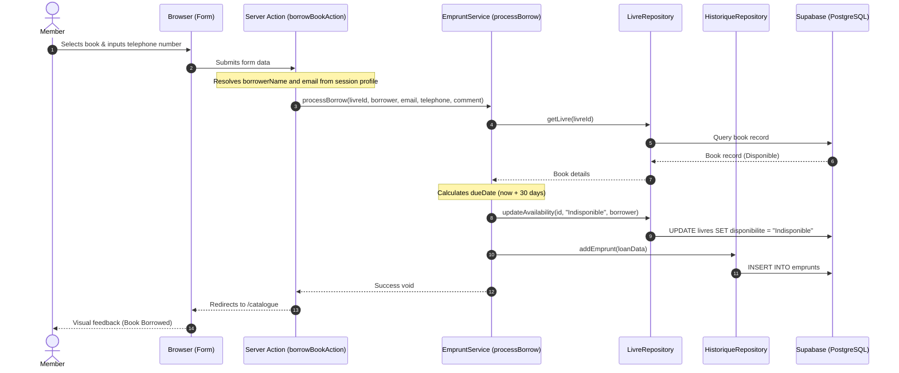
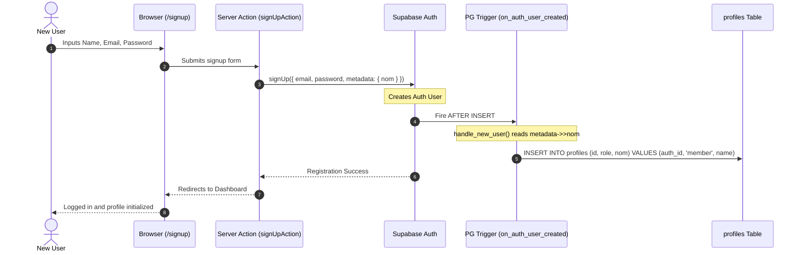

# Club Entrepreneur Library Manager — v2

> The official, premium library management system built by and for the members of the Club Entrepreneur student association at Pôle Léonard de Vinci.

[](https://nextjs.org/)
[](https://www.typescriptlang.org/)
[](https://supabase.com/)
[](https://vitest.dev/)
[](https://vercel.com/)
[](https://opensource.org/licenses/MIT)

---

## Project Purpose & Context

The **Club Entrepreneur** library (Campus Léonard de Vinci, Paris La Défense) holds a private collection of reference books on business, startup methodology, product development, design, and personal growth. 

### Why Version 2?
Version 1 was a quick prototype built using Python and Streamlit. While it proved the concept, it suffered from several technical limitations:
- **No User Isolation**: Lacked proper authenticated profiles; members entered details manually for every borrow.
- **Security Vulnerabilities**: Direct write access to database-like sheets with no access control.
- **Race Conditions**: Parallel borrows on the same book could lead to data corruption.
- **Performance**: High latency in data rendering.

**Version 2** is a complete, enterprise-grade rewrite. Built on **Next.js 15**, **TypeScript**, and **Supabase (PostgreSQL)**, it introduces a clean 3-tier architecture, robust Row Level Security (RLS), real-time search, automated ISBN metadata retrieval, and personal dashboards.

---

## Key Features

- **📚 Catalog & Real-Time Discovery**: Browse, search (full-text search on title/author), and filter books by availability (All / Available / Borrowed).
- **🔍 Smart ISBN Lookup & Auto-fill**: Add a book instantly by scanning or entering its ISBN. Automatically fetches and binds the title, authors, genres/categories, summary, and cover image from the **Google Books API**.
  - **Controlled Tag Selector**: Categories are resolved and matched to pre-defined tags (e.g., Business, Product, Tech) to avoid catalog clutter.
  - **Manual Adjustments**: Contributors can review and adjust any pre-filled field (including custom owner details or custom cover URLs) before saving.
- **👥 Member Account Creation**: Allows self-registration via `/signup`. The database trigger automatically synchronizes newly created Auth users with the database `profiles` table.
- **👤 Personal Space ("Mon Espace")**: Each member gets a dedicated space `/profil` containing:
  - Personal reading metrics and stats cards.
  - Active borrows tracking (with return due dates and color-coded status badges).
  - Borrowing history ledger.
  - Shared books manager showing which of their books are currently lent out and **who currently holds them** (name and email).
  - Book deletion action: lets book owners remove their own contributed books and cascade-delete their borrow history.
  - Inline settings to edit their display name.
- **🛡️ Secure Transactions**: Invariants enforced at the service boundary and index constraints in the database to prevent double-booking or illegal actions.
- **📊 Administration Dashboard**: Key metrics (total books, available, borrowed, overdue count) and a late-returns tracking table.
- **🔒 Role-Based Access Control**: Strict division between `member` and `admin` roles, verified on the server side in Server Actions and in the database through PostgreSQL RLS policies.
- **✉️ Transactional Notifications (Brevo)**: The system keeps users connected and coordinates book logistics using Brevo's transactional API:
  - **Borrow Handoff coordination**: When a borrow occurs, an email is sent to the borrower (with the owner's email) and the owner (with the borrower's name, email, and phone number) to organize physical book delivery.
  - **Overdue Reminders**: Automatic daily Vercel Cron checks active loans and sends a reminder email to late borrowers, which can also be manually triggered by admins from the dashboard.
  - **Monthly Recap**: Monthly Vercel Cron aggregates shared book statistics and sends a thank-you summary to book owners to encourage active library participation.

---

## System Workflows

### 1. Recording a Book Borrow
The diagram below shows how a borrow transaction propagates through the presentation, service, and database repository layers:



### 2. Member Signup & Profile Synchronization
When a new user registers, Supabase triggers an automatic sync to create a custom profile:



---

## Technical Stack

| Layer | Technology | Selection Rationale |
|-------|------------|---------------------|
| **Core Framework** | [Next.js 15 (App Router)](https://nextjs.org/) | Hybrid Server/Client rendering, optimized layouts, and secure Server Actions. |
| **Language** | [TypeScript 5](https://www.typescriptlang.org/) | Static typing, structural interfaces, and complete compile-time validation. |
| **Styling** | [Tailwind CSS](https://tailwindcss.com/) | Rapid, responsive utility-first layout styling. |
| **Backend & DB** | [Supabase](https://supabase.com/) | Postgres backend, instantaneous Authentication, and robust security policies. |
| **Unit Testing** | [Vitest](https://vitest.dev/) | Sub-millisecond testing speeds, native ES modules support, and easy path resolution. |

## Repository Structure

The application is structured into a strict **3-tier layout** separating views, business calculations, and database queries:

```text
.
├── src/
│   ├── app/                    # Presentation Layer (Next.js pages & layouts)
│   │   ├── (auth)/             # Public authentication routing (login, signup)
│   │   ├── (app)/              # Guarded application routes (dashboard, catalog, profiles)
│   │   │   ├── page.tsx        # Dashboard metrics and overdue list
│   │   │   ├── catalogue/      # Catalog browser and filters
│   │   │   ├── ajouter/        # Book adding flow (ISBN autofill + manual)
│   │   │   ├── emprunter/      # Loan entry form
│   │   │   ├── rendre/         # Return entry form
│   │   │   ├── historique/     # Ledger table
│   │   │   ├── profil/         # Member personal space dashboard
│   │   │   └── gerer/          # Admin CRUD panel
│   │   └── api/                # API endpoints (cron webhooks)
│   ├── services/               # Business Logic Layer (pure typescript, no direct Supabase)
│   │   ├── __tests__/          # Service unit tests (Vitest)
│   │   ├── livre.service.ts    # Business logic for book curation and ISBN
│   │   ├── emprunt.service.ts  # Rules for loans, status calculations (J+30, colors)
│   │   └── profile.service.ts  # Rules for profile updates (name checks)
│   ├── repositories/           # Data Access Layer (raw Supabase queries only)
│   │   ├── livre.repository.ts # Supabase queries on 'livres' table
│   │   ├── historique.repository.ts # Supabase queries on 'emprunts' table
│   │   └── profile.repository.ts # Supabase queries on 'profiles' table
│   ├── lib/
│   │   └── supabase/           # Supabase client instances (browser-safe & server-safe)
│   └── types/                  # Shared TypeScript type definitions
├── docs/                       # Comprehensive development, specifications, and architecture docs
└── supabase/
    └── migrations/             # SQL schema migrations (RLS, tables, indexes, triggers)
```

---

## Database Security (Row Level Security)

RLS is strictly enforced at the database level:
- **`profiles`**: All logged-in users can view all profiles (to see book owners). Users can only update their own profile name (`id = auth.uid()`), and new profiles can be created during self-registration with member privileges.
- **`livres`**: Read is public to authenticated users. Book insertion is open to all members (to share books). Update is open to all authenticated users (needed for borrow status updates), and deletion is permitted for administrators or the book's owner.
- **`emprunts`**: Read is public to authenticated users. Insertion is open to all users. Update is allowed for administrators, the borrower, or the book's owner.

---

## Development Setup

### 1. Installation
Clone the repository and install dependencies:
```bash
git clone https://github.com/MaximeFARRE/club-entrepreneur-library-v2.git
cd club-entrepreneur-library-v2
npm install
```

### 2. Environment Variables
Create a `.env.local` file at the root:
```bash
cp .env.local.example .env.local
```
Provide the appropriate keys from your Supabase dashboard:
```env
NEXT_PUBLIC_SUPABASE_URL=https://your-project.supabase.co
NEXT_PUBLIC_SUPABASE_ANON_KEY=your-anon-public-key
SUPABASE_SERVICE_ROLE_KEY=your-service-role-secret-key
BREVO_API_KEY=xkeysib-your-brevo-api-key
BREVO_SENDER_EMAIL=bibliotheque@club-entrepreneur.example
BREVO_SENDER_NAME=Club Entrepreneur
CRON_SECRET=your-random-cron-secret
```

### 3. Database Schema Setup
You can push the database migrations directly using the Supabase CLI:
```bash
npx supabase db push
```
Alternatively, apply the SQL schemas sequentially from [DATABASE_SCHEMA.md](file:///Users/macbook/Documents/Projet%20perso/club-entrepreneur-library-v2/docs/DATABASE_SCHEMA.md) in the Supabase SQL editor.

### 4. Running the App
Start the hot-reloading development server:
```bash
npm run dev
```
Open [http://localhost:3000](http://localhost:3000).

---

## Testing & Typechecks

We utilize **Vitest** for isolated unit testing. To run the full test suite (39 tests checking validation, calculations, date handling, sorting, and error boundaries):
```bash
# Run tests once
npm test

# Run tests in interactive watch mode
npx vitest
```

To run a static typecheck on the codebase:
```bash
npx tsc --noEmit
```

---

## Contributors

- **Maxime FARRE** (Club Entrepreneur Lead Dev)
